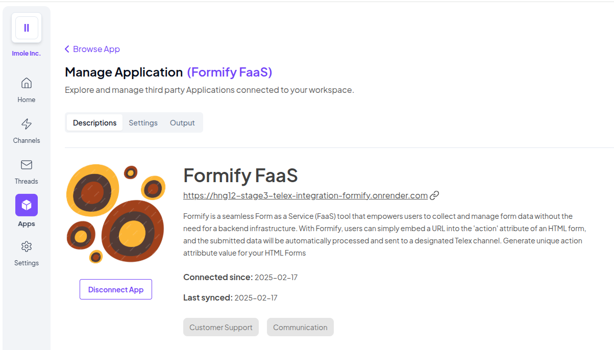

# hng12-stage3-telex-integration_formify

Formify is a seamless Form as a Service (FaaS) tool that empowers users to collect and manage form data without the need for a backend infrastructure. With Formify, users can simply embed a URL into the "action" attribute of an HTML form, and the submitted data will be automatically processed and sent to a designated Telex channel.

Generate unique action attribbute value for your HTML Forms



## KEY FEATURES

- No Backend Required,
- Easy Integration,
- Real-time Data Submission,
- Scalable and Secure,
- No Extra Coding Required

## Integration URL

The Integration JSON for Formify FaaS Telex Integration is
`https://hng12-stage3-telex-integration-formify.onrender.com/formify-integration.json`

The target url is found in the in the JSON.

## How to set up and Deploy Formify FaaS Integration

# Go Formify FaaS Telex Integration

This project is a Go-based API integration designed for seamless communication with telex. The integration provides a robust and efficient way to respond to Telex target url call and also responds to html form submissions.

## Prerequisites

Ensure you have the following installed:

- [Go](https://go.dev/dl/) (1.22 or later)
- [Git](https://git-scm.com/)

## Installation

Clone the repository and navigate to the project directory:

```sh
git clone git@github.com:imoleBytes/hng12-stage3-telex-integration_formify.git
cd hng12-stage3-telex-integration_formify
```

Install dependencies:

```sh
go mod tidy
```

## Configuration

Create a `.env` file in the root directory and set environment variables:

```sh
BASE_URL=https://api.example.com
```

## Running the Application

Start the server with:

```sh
go run main.go
```

The Integration json will be available at `http://localhost:8080/formify-integration.json`.

## Testing

Run unit tests using:

```sh
go test ./...
```

To test endpoints, use tools like [Postman](https://www.postman.com/) or `curl`:

This generate a unique url to be embedded on the HTML form.

```sh
curl -X POST "http://localhost:8080/generate-formify" \
     -H "Content-Type: application/json" \
     -d '{
       "channel_id": "01952918-e2c0-7d99-b481-2a3c1b16fb6a",
       "settings": [
          {"label": "Form Name","type": "text","default": "Sample Form","required": true},
          {"label": "Website","type": "text","default": "sample-website-name","required": true},
          {"label": "ChannelID","type": "text","default": "01952918-e2c0-7d99-b481-2a3c1b16fb6a","required": true}
        ],
       "message": "/generate_url"
     }'
```

## Deployment

### **Deploying to a Cloud Provider (Heroku, AWS, etc.)**

1. Build the binary:
   ```sh
   go build -o app
   ```
2. Deploy the `app` binary along with the `.env` file to the server.
3. Use a process manager like `systemd` or `pm2` to keep the service running.

## How To Use Formify Integration On Telex (User's Perspective)

- Activate the Formify FaaS Integration in the Apps List on the Telex web platform (telex.im)
  - This is done by toggling the button besides `Manage App` button
    
- Click on its `Manage App` and navigate to the settings tab, The Integration requires three settings
  - Form Name e.g Contact Form, etc
  - Website (-- just the name of the website is fine, not the url)
  - ChannelID (the channel ID where you want the form data to be submitted)
    
- Navigate to the Output Tab and select the channels where you want to trigger the integration
  - It can also serve the channel where you want all the form data to be populated.
    
- Go to the designated channel. The command to to get the Unique url to be embeded into your HTML formis gotten by typing `/generate_url` in the channel and enter.
  

  - copy the generated url and place it in action attribute of your HTML Form. Set the Method to POST.

  ```html
  <form
    class="space-y-6"
    method="post"
    action="https://hng12-stage3-telex-integration-formify.onrender.com/formify/sample-website-name/01952918-e2c0-7d99-b481-2a3c1b16fb6a"
  >
    <div class="space-y-4">
      <div class="relative">
        <input
          type="text"
          name="name"
          required
          class="peer w-full px-4 py-3 border-2 border-gray-200 rounded-lg outline-none transition-all duration-300 focus:border-gray-400 placeholder-transparent"
          placeholder="Your Name"
        />
        <label
          class="absolute left-4 -top-2.5 bg-white px-2 text-sm text-gray-600 transition-all duration-300 peer-placeholder-shown:text-base peer-placeholder-shown:text-gray-400 peer-placeholder-shown:top-3 peer-focus:-top-2.5 peer-focus:text-sm peer-focus:text-gray-600"
        >
          Your Name
        </label>
      </div>

      <div class="relative">
        <input
          type="email"
          name="email"
          required
          class="peer w-full px-4 py-3 border-2 border-gray-200 rounded-lg outline-none transition-all duration-300 focus:border-gray-400 placeholder-transparent"
          placeholder="Email Address"
        />
        <label
          class="absolute left-4 -top-2.5 bg-white px-2 text-sm text-gray-600 transition-all duration-300 peer-placeholder-shown:text-base peer-placeholder-shown:text-gray-400 peer-placeholder-shown:top-3 peer-focus:-top-2.5 peer-focus:text-sm peer-focus:text-gray-600"
        >
          Email Address
        </label>
      </div>

      <div class="relative">
        <input
          type="text"
          name="subject"
          required
          class="peer w-full px-4 py-3 border-2 border-gray-200 rounded-lg outline-none transition-all duration-300 focus:border-gray-400 placeholder-transparent"
          placeholder="Subject"
        />
        <label
          class="absolute left-4 -top-2.5 bg-white px-2 text-sm text-gray-600 transition-all duration-300 peer-placeholder-shown:text-base peer-placeholder-shown:text-gray-400 peer-placeholder-shown:top-3 peer-focus:-top-2.5 peer-focus:text-sm peer-focus:text-gray-600"
        >
          Subject
        </label>
      </div>

      <div class="relative">
        <textarea
          name="message"
          required
          rows="4"
          class="peer w-full px-4 py-3 border-2 border-gray-200 rounded-lg outline-none transition-all duration-300 focus:border-gray-400 placeholder-transparent resize-none"
          placeholder="Your Message"
        ></textarea>
        <label
          class="absolute left-4 -top-2.5 bg-white px-2 text-sm text-gray-600 transition-all duration-300 peer-placeholder-shown:text-base peer-placeholder-shown:text-gray-400 peer-placeholder-shown:top-3 peer-focus:-top-2.5 peer-focus:text-sm peer-focus:text-gray-600"
        >
          Your Message
        </label>
      </div>
    </div>

    <button
      type="submit"
      class="w-full bg-gray-900 text-white py-3 px-6 rounded-lg transition-all duration-300 hover:bg-gray-800 focus:outline-none focus:ring-2 focus:ring-gray-400 focus:ring-offset-2"
    >
      Send Message
    </button>
  </form>
  ```

- Hit Submit and check your channel, the form data will be ther
  

### Credits And Copyrights

Formify Logo source is [freepik](https://www.freepik.com/)
The Logo: [retro-circular-pattern-design](https://img.freepik.com/free-vector/retro-circular-pattern-design_1308-175051.jpg?t=st=1739808712~exp=1739812312~hmac=f03b43859fc31fbdd675f1907599bd626959e488186958f208d879c6fd1ef10a&w=740)

## Contact

For support or inquiries, reach out to [Imolebytes](https://github.com/imolebytes) or open an issue on GitHub.
